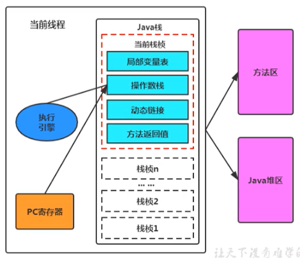
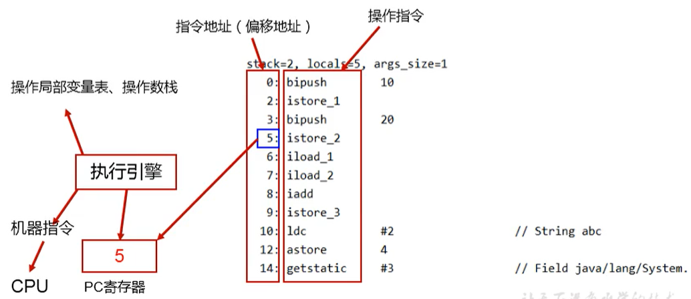

# 程序计数器

## PC Register介绍

JVM中的程序计数寄存器（Program Counter Register）中，Register的命名源于CPU的寄存器，寄存器存储指令相关的现场信息。CPU只有把数据装载到寄存器才能够运行。

这里， 并非是广义上所指的物理寄存器，或许将其翻译为PC计数器（或指令计数器）会更加贴切（也称为程序钩子），并且也不容易引起一些不必要的误会。JVM中的PC寄存器是对物理PC寄存器的一种抽象模拟。

作用：PC寄存器用来存储己像下一条指令的地址，也即将要执行的代码。由执行引擎读取下一条指令。

- 它是一块很小的内存空间，几乎可以忽略不记。也是运行速度最快的存储区域。
- 在JVM规范中，每个线程都有它自己的程序计数器，是线程私有的，生命周期与线程的生命周期保持一致。
- 任何时间一个线程都只会有一个方法在执行，也就是所谓的当前方法。程序计数器会存储当前线程正在执行的Java方法的JVM指令地址；或者，如果是在执行native方法，则是未指定值（undefined）。
- 它是程序控制流的指示器，分支、循环、跳转、异常处理、线程恢复等基础功能都需要依赖这个计数器来完成。
- 字节码解释器工作时就是通过改变这个计数器的值来选取下一条需要执行的字节码指令。
- 它是唯一一个在Java虚拟机规范中没有规定任何OutOfMemoryError情况的区域

通过PC寄存器，我们就可以知道当前程序执行到哪一步了  

## 两个常见问题

- 使用PC寄存器存储字节码指令地址有什么用？为什么使用PC寄存器记录当前线程的执行地址呢？
  - 因为CPU需要不停的切换各个线程，这时候切换回来以后，就得知道接着从哪儿开始继续执行。JVM的字节码解释器就需要通过改变PC寄存器的值来明确下一条应该执行什么样的字节码指令。
- PC寄存器为什么会被设定为线程私有？
  - 在多线程的情况下，CPU会不停的做任务切换，这样必然导致经常终端或恢复正在执行的方法。为了能够准确的记录各个线程正在执行的当前字节码指令地址，最好的办法自然是每个线程分配一个PC寄存器，这样各个线程间独立管理不会相互干扰。