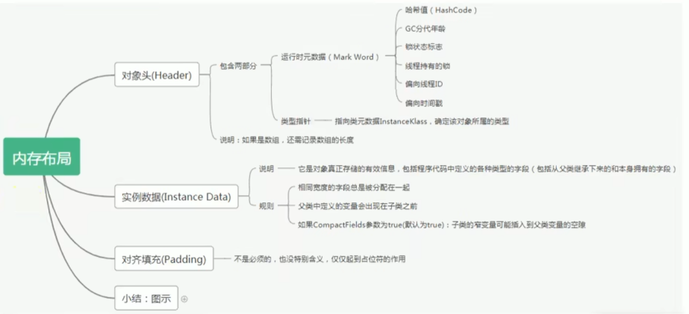
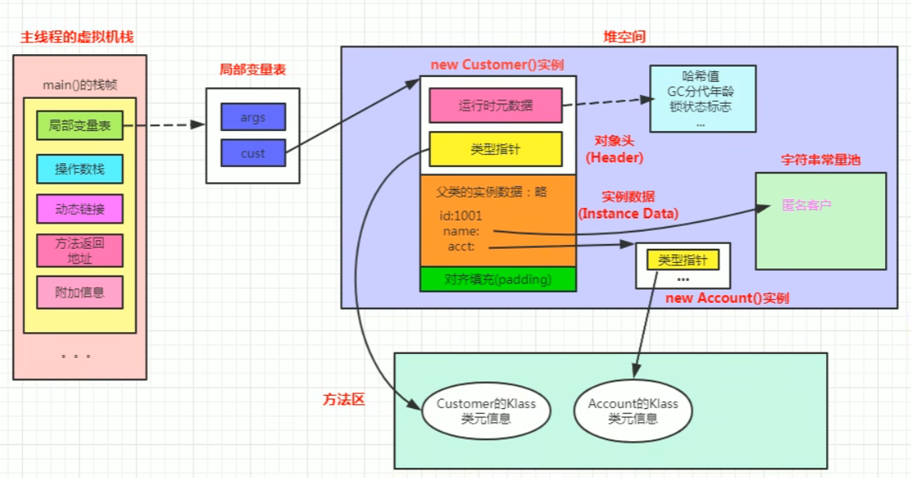
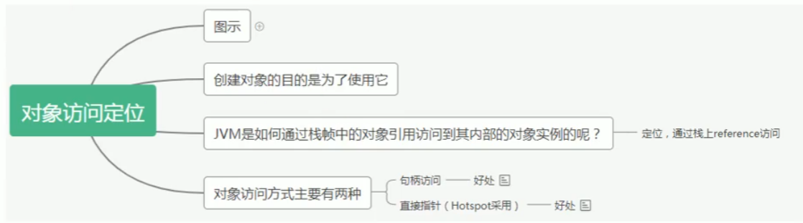
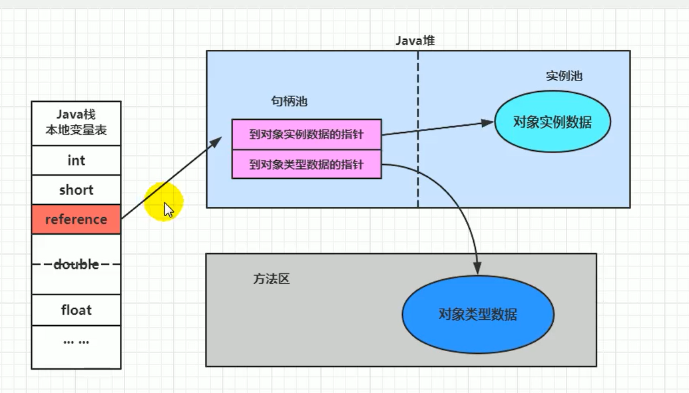
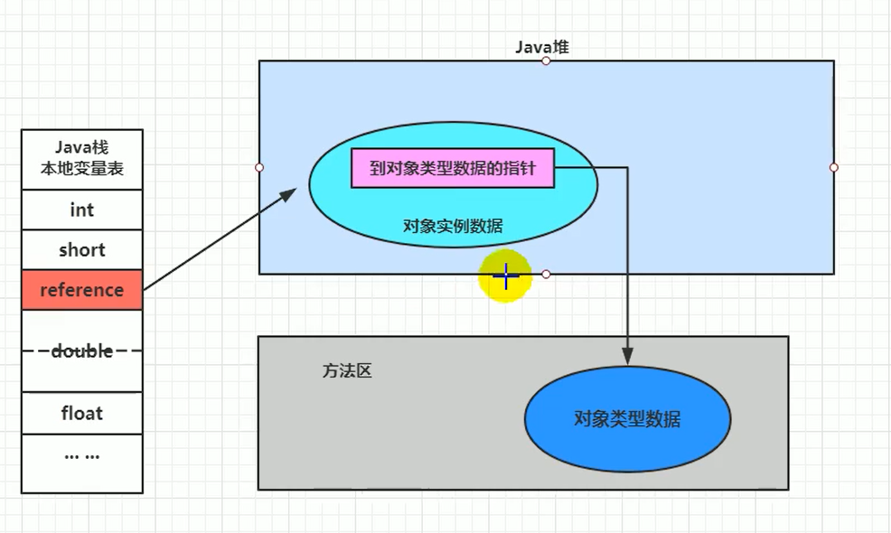

# 对象的实例化内存布局与访问定位

## 对象的实例化

#### 判断对象对应的类是否加载、链接、初始化

虚拟机遇到一条new指令，首先去检查这个指令的参数能否在Metaspace的常量池中定位到一个类的符号引用，并且检查这个符号引用代表的类是否已经被加载、解析和初始化。（即判断类元信息是否存在）。如果没有，那么在双亲委派模式下，使用当前类加载器以ClassLoader + 包名 + 类名为key进行查找对应的 .class文件。如果没有找到文件，则抛出ClassNotFoundException异常，如果找到，则进行类加载，并生成对应的Class对象。

#### 为对象分配内存

首先计算对象占用空间大小，接着在堆中划分一块内存给新对象。如果实例变量成员是引用变量，仅分配引用变量空间即可，即4个字节大小。**对象所需内存的大小在类加载完成后便可完全确定**。内存分配完成后，虚拟机必须将分配到的内存空间（不包括对象头）都初始化为零指，如果使用了TLAB的话，这项工作也可以提前至TLAB分配时顺便进行。这步操作**保证了对象的实例字段在Java代码中可以不赋初始值就直接使用，使程序能访问到这些字段的数据类型所对应的零值。**

接下来，Java虚拟机还要对对象进行必要的设置，例如这个对象是哪个类的实例、如何才能找到类的元数据信息、对象的哈希码（**真正调用Object::hashCode()方法时才计算**）、对象的GC分代年龄等信息。这些信息存放在对象的对象头（Object Header）之中。根据虚拟机当前运行状态不同，如是否启用偏向锁等，对象头会有不同的设置方式。

##### 如果内存规整——指针碰撞

如果内存是规整的，那么虚拟机将采用的是指针碰撞法（Bump The Pointer）来为对象分配内存。

意思是所有用过的内存在一边，空闲的内存放另外一边，中间放着一个指针作为分界点的指示器，分配内存就仅仅是把指针指向空闲那边挪动一段与对象大小相等的距离罢了。如果垃圾收集器选择的是Serial ，ParNew这种基于压缩算法的，虚拟机采用这种分配方式。一般使用带Compact（整理）过程的收集器时，使用指针碰撞。

##### 如果内存不规则——空闲列表分配

如果内存不是规整的，已使用的内存和未使用的内存相互交错，那么虚拟机将采用的是空闲列表法来为对象分配内存。

意思是虚拟机维护了一个列表，记录上那些内存块是可用的，再分配的时候从列表中找到一块足够大的空间划分给对象实例，并更新列表上的内容。这种分配方式称为“空闲列表（Free List）”。

##### 说明

选择那种分配方式由Java堆是否规整决定，而Java堆是否规整又由所采用的垃圾收集器是否带有压缩整理功能决定。

#### 处理并发安全问题

- 采用CAS失败重试、区域加锁保证更新的原子性
- 每个线程预先分配TLAB - 通过设置 -XX:+UseTLAB参数来设置
  - 在Eden区给每个线程分配一块区域

#### 初始化分配到的空间

所有属性设置默认值，保证对象实例字段在不赋值时可以直接使用。

#### 设置对象的对象头

将对象的所属类（即类的元数据信息）、对象的HashCode和对象的GC信息、锁信息等数据存储在对象的对象头中。这个过程的具体设置方式取决于JVM的实现。

#### 执行init方法进行初始化

在Java程序的视角看来，初始化才正式开始。初始化成员变量，执行实例化代码块，调用类的构造方法，并把堆内对象的首地址赋值给引用变量

因此一般来说（由字节码中跟随invokespecial指令所决定），new指令之后会接着就是执行方法，把对象按照程序员的意愿进行初始化，这样一个真正可用的对象才算完成创建出来。

## 对象的内存布局

在HotSpot虚拟机里，对象在内存中的存储布局可分为三个部分：对象头（Header）、实例数据（Instance Data）和对齐填充（Padding）。

### 对象头

对象头的**Mark Word**被设计为一个有着**动态定义的数据结构**，以便在极小的空间内存储尽可能多的数据，根据对象的状态**复用**自己的存储空间。

| 存储内容                             | 标志位 | 状态                 |
| ------------------------------------ | ------ | -------------------- |
| 对象哈希码、对象分代年龄             | 01     | 未锁定               |
| 指向锁记录的指针                     | 00     | 轻量级锁定           |
| 指向重量级锁的指针                   | 10     | 锁膨胀（重量级锁定） |
| 空，不需要记录信息                   | 11     | GC标记               |
| 偏向线程ID、偏向时间戳、对象分代年龄 | 01     | 可偏向               |

对象头的另一部分是**类型指针**，即**对象指向它的类型元数据的指针**，Java虚拟机通过这个指针来**确定该对象是哪个类的实例**。如果对象是一个Java数组，那在对象头中还必须有一块用于**记录数组长度的数据**，因为虚拟机可以通过普通Java对象的**元数据信息**确定Java对象的大小，但是如果数组长度是不确定的，将无法通过元数据中的信息推断出数组的大小。

### 实例数据

 对象的**实例数据**部分是对象真正存储的有效信息，即我们在程序代码里所定义的各种类型的字段内容，无论是从父类继承下来的，还是在子类中定义的字段都必须记录起来。

### 对齐填充

对象的第三部分是**对齐填充**，这并不是必然存在的，也没有特别的含义，它仅仅起占位符的作用。

## 对象的访问定位

JVM是如何通过栈帧中的对象引用访问到其内部的对象实例呢？

### 对象访问的两种方式

#### 句柄访问

优点：reference中存储稳定句柄地址，对象被移动（垃圾收集时移动对象很普遍）时只会改变句柄中实例数据指针即可，reference本身不需要被修改

#### 直接指针（HotSpot采用）

直接指针是局部变量表中的引用，直接指向堆中的实例，在对象实例中有类型指针，指向的是方法区中的对象类型数据。

优点：使用直接指针的最大好处就是速度更快，它节省了一次指针定位的时间开销，由于对象访问在Java中非常频繁，因此这类开销积少成多也是一项极为可观的执行成本。
